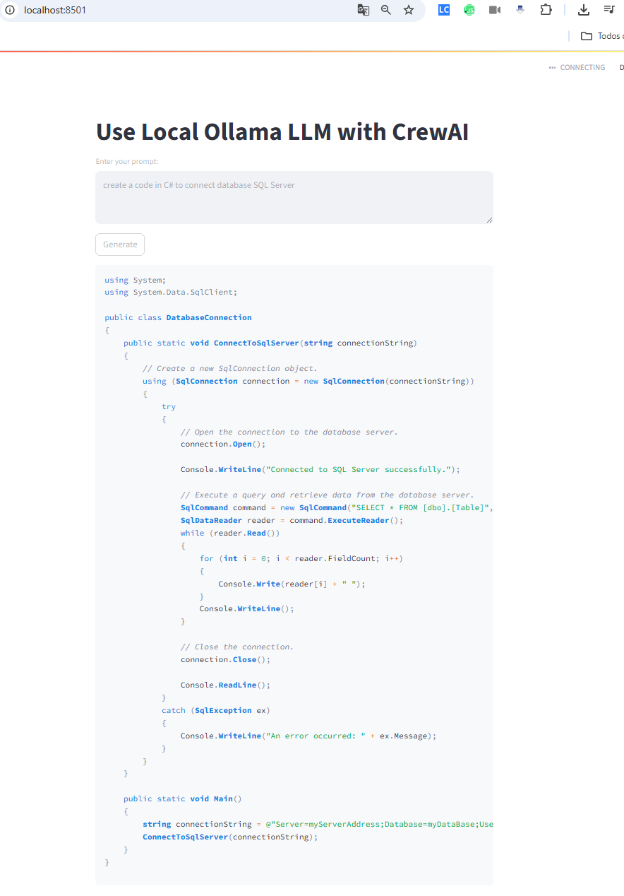

# Ollama Chat + CrewAI Integration 🚀

<div align="center">
  
  
  
  
</div>

## 📝 Descrição
Aplicação web que integra **CrewAI** com modelos LLM locais via **Ollama**, utilizando Streamlit para interface. Permite interação com modelos como LLaMA3 diretamente do seu hardware.

## ✨ Funcionalidades
- ✅ Chat com LLM local (sem dependência de APIs externas)
- ✅ Arquitetura modular com agentes/tarefas do CrewAI
- ✅ Interface simples via Streamlit
- ✅ Suporte a múltiplos modelos do Ollama

## 🛠️ Pré-requisitos
- Python 3.9+
- Ollama instalado ([Guia de instalação](https://ollama.ai/))
- Modelo LLaMA3 baixado (ou outro suportado)

## 🚀 Como Executar
```bash
# 1. Clone o repositório
git clone https://github.com/seu-usuario/ollama-crewai-chat.git
cd ollama-crewai-chat

# 2. Instale as dependências
pip install -r requirements.txt

# 3. Baixe o modelo (se não tiver)
ollama pull llama3:3b

# 4. Execute a aplicação
streamlit run Thor.py


🧩 Estrutura do Projeto
text
.
├── Thor.py                # Aplicação principal
├── README.md             # Este arquivo
├── requirements.txt      # Dependências
└── .gitignore           # Arquivos ignorados
🖼️ Screenshot

<div align="center">
  
</div>


🤝 Como Contribuir
Faça um fork do projeto

Crie sua branch (git checkout -b feature/nova-funcionalidade)

Commit suas mudanças (git commit -m 'Add nova funcionalidade')

Push para a branch (git push origin feature/nova-funcionalidade)

Abra um Pull Request

📜 Licença
MIT License - Consulte o arquivo LICENSE para detalhes.

Desenvolvido com ❤️ por Fábio Leandro Lapuinka
📅 Última atualização: Julho/2025

text

### Elementos incluídos:
1. **Badges** visuais para tecnologias
2. **Seção clara de pré-requisitos**
3. **Comandos de instalação** passo a passo
4. **Estrutura de arquivos** organizada
5. **Seção de contribuição** padrão para GitHub
6. **Espaço para screenshot** (basta adicionar uma imagem `screenshot.png`)
7. **Responsivo** (com alinhamento central)

### Dicas extras:
- Adicione um arquivo `LICENSE` se quiser usar MIT/outra licença
- Para screenshot: tire um print da interface e salve como `screenshot.png` na raiz
- Substitua `seu-usuario` pelo seu username do GitHub

Quer que eu adapte alguma seção específica? 😊
